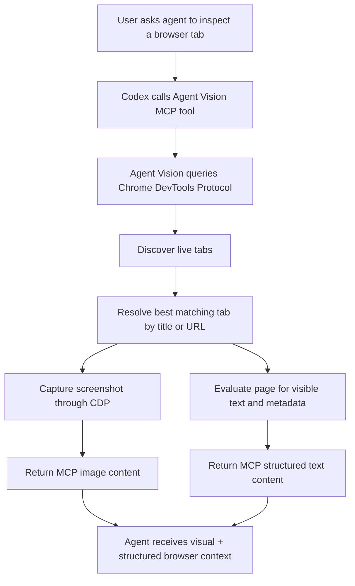

<div align="center">
  <h1>Agent Vision</h1>
  <p>
    
    
    
    
    
  </p>
</div>

Agent Vision is a browser-first MCP server that gives agents direct visual access to live Chrome or Brave tabs through the Chrome DevTools Protocol. Instead of asking users to manually capture screenshots and upload them into chat, Agent Vision lets a coding agent resolve a tab by title or URL, capture a real screenshot on demand, and pull structured browser context like visible text, page metadata, and viewport details in the same flow.

## Problem

LLM workflows break down when visual browser context is trapped behind manual steps. A user sees an issue in a tab, but the agent cannot see the same thing unless the user pauses, takes a screenshot, uploads it, and adds extra explanation. That friction slows debugging, weakens iteration speed, and loses important structured context that browsers already expose natively. Agent Vision solves this by making browser state directly available as MCP tools.

## Workflow



## Tools

| Tool | What it does |
| --- | --- |
| `getBrowserCdpStatus` | Checks whether Agent Vision can reach the configured Chrome DevTools Protocol endpoint. |
| `discoverBrowserTabsViaCdp` | Returns the raw live tab list exposed by Chrome DevTools Protocol. |
| `refreshLiveBrowserTabs` | Refreshes the normalized in-memory live tab model from CDP. |
| `listLiveBrowserTabs` | Returns the cached normalized live tab model without re-querying the browser. |
| `pruneStaleLiveBrowserTabs` | Removes cached tabs that have become stale because they have not been refreshed recently. |
| `resolveLiveBrowserTab` | Resolves the active or best matching tab for a `/see`-style query using title and URL heuristics. |
| `captureResolvedBrowserTabScreenshot` | Captures a real PNG screenshot from the resolved browser tab via CDP. |
| `getResolvedBrowserTabContext` | Extracts structured page context such as visible text, page title, page URL, language, content type, and viewport metadata. |
| `seeBrowserTabViaCdp` | Runs the full high-level browser inspection flow: resolve tab, capture screenshot, and return structured browser context. |

## Setup And Installation

### Prerequisites

- Node.js 22+
- Brave, Chrome, or another Chromium-based browser
- Codex configured locally with MCP support

### Install dependencies

```bash
npm install
npm run build
```

### Start a CDP-enabled browser session

```bash
brave-browser --remote-debugging-port=9222 --user-data-dir=/tmp/agent-vision-cdp
```

### Register Agent Vision in Codex

Add this to `~/.codex/config.toml`:

```toml
[mcp_servers.agent-vision]
command = "/home/kedar/.nvm/versions/node/v22.22.0/bin/node"
args = ["/home/kedar/Desktop/Projects/llm_vision/dist/mcp-stdio.js"]
```

Then restart Codex.

### Verify the MCP server is available

```bash
codex mcp list
```

## Example Usage

### Manual local verification

```bash
npm run demo-cdp
```

### Example Codex prompts

```text
Use the agent-vision MCP server to list my live browser tabs.
Use the agent-vision MCP server to inspect the active browser tab.
Use the agent-vision MCP server to inspect the tab matching "docs".
```

### Future npm-distributed registration shape

After publishing, the Codex config can switch to:

```toml
[mcp_servers.agent-vision]
command = "npx"
args = ["-y", "agent-vision-mcp"]
```

## License

MIT. See [LICENSE](./LICENSE).
